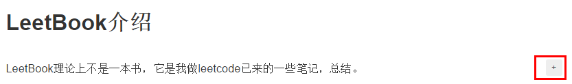

 By [Voidsky(黄锴）](https://github.com/hk029)

---
# 写在前面
>本人一直有写书的“小梦想”，机缘巧合碰到gitbook，也算看缘分，虽然我知道这本“书”远达不到想象中的书的概念，但是，我仍然视其我第一本书。尽管它不能出版，也不会被人广泛阅读，但却值得我小心呵护。我希望通过自己的努力能慢慢的让这本"不是书的书"变得丰满起来。也算是给我最后这段校园时光留下点什么印记。

# LeetBook介绍

LeetBook理论上不是一本书，它是我做leetcode已来的一些笔记，总结。

本“书”不是一蹴而就的，是本人在刷题过程中做的笔记逐步积累起来的，并会随着我的刷题而变得丰富。

每道题后面的[E][M][H]代表了这个题的难度等级，分别是轻松，略有难度，很难

**强调：**本人并不是什么大神，只是喜欢整理归纳，喜欢把别人的思维转换成自己更易懂的形式。在刷题过程中，会有很多自己的解题思路和感想，也会有很多灵光一现的瞬间，我习惯用马克飞象（一个支持印象笔记的第三方markdown编辑器)把这些瞬间捕捉下来，所以我很多笔记都存在印象笔记中。而偶然间遇到gitbook，又刚好支持markdown，这也促成就是这本书的诞生。

# 为什么要写做这个？
我相信很多为了找工作都开始刷LeetCode了，我也不例外，LeetCode目前应该是找工作领域最权威的刷题网站了，上面的题目都很有代表性，也是很多公司喜欢问的，所以也成就了现在刷LeetCode的狂热。

但是，很多人都发现了一个问题，只是一味的刷题，却没有机会对每个题目做一个整理或总结。导致题目做过一遍，但是没什么印象，很多题目虽然A过了，但是实际上用的是比较笨，或者比较费时的思路，有更多更精彩，更简单的思路没有考虑到。导致一遍下来收获并不大。

所以这里推出这本书，一方面，方便大家A题后来复习看看，也方便大家来这里找每道题新的思路。也督促自己对每道题尽可能的想全面点。

# 这本书力求做到
1. 覆盖尽可能多的题目
2. 每道题力求多种思路解决
3. 解答思路尽可能清晰，易懂

这也算对自己的一个鞭策，每道题让自己考虑出更加容易理解的思路，也方便日后的复习。

# 声明
1. 它不是一本算法或数据结构书，这毕竟是一本有关解题思路的“书”，它默认你是有一定的算法和数据结构基础的，如果你在这方面还十分欠缺，推荐你看下下面相关推荐的书（我以后有时间可能会结合自己的能力加上每类题型的讲解，相关算法等）
2. 这本“书”目前是我一个人闲暇时间完成，所以更新速度上不会特别快，大概每周4-6篇，跟我这周做题时间有关。

# 相关推荐
- 书籍推荐(以下链接都是豆瓣读书的链接，可以方便你了解详情)
  1. [《算法》](https://book.douban.com/subject/10432347/)（红宝书，书内有能运行的代码，大量图示，而且讲解的通俗易懂，作者是普林斯顿大学计算机学院院长，Kuth的徒弟，算法界的牛人！这里我不打算推荐算法导论，因为它太深了，不适合以找工作为目的的同学）
  2. [《大话数据结构》](https://book.douban.com/subject/6424904/)（数据结构就推荐这本，国内教材都过于悔涩，这个适合自学）
  3. [《编程珠玑》](https://book.douban.com/subject/3227098/)（你会很明确知道什么叫精华）
  4. [《编程之美》](https://book.douban.com/subject/3004255/)（微软的面试宝典）
  5. 待续
- 博客推荐
  1. [blog.csdn.net/hk221976](blog.csdn.net/hk221976) （不要脸的先推荐了自己的博客 -- 捂脸）
  2. 待续

# 关于评论
gitbook的书都是可以评论的，把鼠标移动到文字上，就会出现“+“号，点击就可以对这个文字进行评论

# 联系我
毕竟是自己一个人的工作，虽然每道题我都力求做到完善。但是可能还是会出现一些不足，如果有什么问题或建议，可以联系我：

- 黄锴
  - 邮箱   [hk2291976@hotmail.com](hk2291976@hotmail.com)
  - CSDN博客 [blog.csdn.net/hk221976](blog.csdn.net/hk221976)
  - 微信 justme029
  - qq 263791865

或者你可以直接加入我，一起来完善这本书，这本书的github地址：https://github.com/hk029/leetbook

# 更新情况
##1.0版本
这是最原始的版本，完善了首页介绍和书的框架，加入了目前整理的解题思路