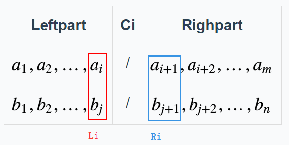
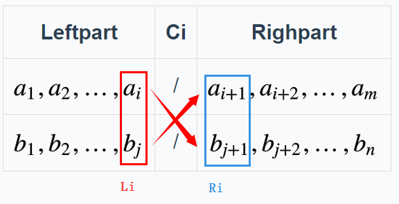
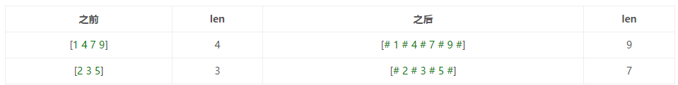
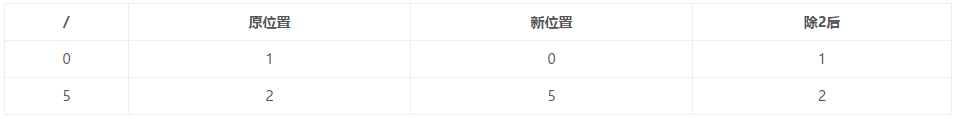

#004. Median of Two Sorted Arrays[H]
---

#**题目**
There are two sorted arrays nums1 and nums2 of size m and n respectively. Find the median of the two sorted arrays. The overall run time complexity should be O(log (m+n)).

#**分析**
这个题目是非常的常见，而且有特别多的变形。特别是在当前大数据的环境下，如何快速查找第i个元素有很现实的意义。

<font color=red>关注D&C方法的，直接看思路2

##**思路1**
很简单的思路：就是遍历两个数组，在里面找到第i个大元素，这个应该还是比较简单的，时间复杂度O(m+n)。

用2个变量分别指向两个数组，每次取较小的一个，然后将其指针后移动。但是这里有个问题，就是奇偶判断，如果是奇数，中位数是num[mid]，但是如果是偶数，是(num[mid]+num[mid-1])/2。这里我的做法是把num[mid]看作(num[mid]+num[mid])/2。如果是偶数-1,奇数-0。

```c++
class Solution {
public:
    double findMedianSortedArrays(vector<int>& nums1, vector<int>& nums2) {
        if(nums1.size() == 0)
            return MedofArray(nums2);
        if(nums2.size() == 0)
            return MedofArray(nums1);    
        vector<int> num3;
        int size = (nums1.size()+nums2.size());
        int mid = size/2;
        int flag = !(size%2);
        int i,m1,m2,cur;
        double a,b;
        for(i = m1 = m2 = 0;i < size;i++)
        {   
            a = m1 < nums1.size()?nums1[m1]:INT_MAX;//过界处理
            b = m2 < nums2.size()?nums2[m2]:INT_MAX;//过界处理
            //cout<<i<<" a "<<a<<" b "<<b<<endl;
            if(a < b)
            {
                num3.push_back(nums1[m1]);
                m1++;
            }
            else
            {
                num3.push_back(nums2[m2]);
                m2++;
            }
            if(i == mid)
                break;
        }
        return (num3[mid]+num3[mid-flag])/2.0;
    }
    double MedofArray(vector<int>& nums)
    {
        int mid = nums.size()/2;
        int flag = !(nums.size()%2);
        return (nums[mid]+nums[mid-flag])/2.0;
    }
};
```


##思路2
**<font color=orange size=4>重点来了!!</font>**

这是一个很经典的Divide & Conquer的题目，关键就在如何划分。这里引用stellari 的高分答案，觉得他这个讲的特别好：


#**预备知识**
##**先解释下“割”**

><font size=3>我们通过切一刀，能够把**有序**数组分成左右两个部分，切的那一刀就被称为割(Cut)，割的左右会有两个元素，分别是左边最大值和右边最小值。

><font size=3>我们定义L = Max(LeftPart)，R = Min(RightPart)

<font size=3>Ps. 割可以割在两个数中间，也可以割在1个数上，如果割在一个数上，那么这个数即属于左边，也属于右边。（后面讲单数组中值问题的时候会说）

<font size=3>比如说[2 3 5 7]这个序列，割就在3和5之间
<font size=3>[2 3 / 5 7]
<font size=3>中值就是（3+5）/2 = 4

<font size=3>如果[2 3 4 5 6]这个序列，割在4上，我们可以把4分成2个
<font size=3>[2 3 (4/4) 5 7]
<font size=3>中值就是（4+4）/2 = 4

<font size=3>这样可以保证不管中值是1个数还是2个数都能统一运算。


##**割和第k个元素**
<font size=3>对于单数组，**找其中的第k个元素特别好做**，我们用割的思想就是：
><font size=3>**常识1：**如果在k的位置割一下，然后A[k]就是L。换言之，就是如果左侧有k个元素，A[k]属于左边部分的最大值。（都是明显的事情，这个不用解释吧！）

##**双数组**
我们设:
**$$C_i$$**为第i个数组的割。
**$$L_i$$**为第i个数组割后的左元素.
**$$R_i$$**为第i个数组割后的右元素。



###**我们看如何从双数组里取出第k个元素**

1. 首先$$L_i <= R_i$$是肯定的（因为数组有序，左边肯定小于右边）
2. 如果我们让$$L_1 <= R_2$$  &&   $$L_2 <= R_1$$

3. 那么左半边 全小于右半边，<font color=red>如果左边的元素个数相加刚好等于k</font>，那么第k个元素就是Max(L1,L2)，参考上面常识1。
4. 如果 <font color=blue>L1>R2</font>，说明数组1的左边元素太大（多），我们把<font color=blue>C1减小，把C2增大。L2>R1</font>同理，把<font color=blue>C1增大，C2减小。


###**假设k=3**
对于

$$[1\ 4\ 7\ 9]$$

$$[2\ 3\ 5]$$

设C1 = 2，那么C2 = k-C1 = 1

$$[1\ 4/ 7\ 9]$$

$$[2/3\ 5]$$

这时候，L1(4)>R2(3)，说明C1要减小，C2要增大，C1 = 1，C2=k-C1 = 2

$$[1/4\ 7\ 9]$$

$$[2\ 3/5]$$

这时候，满足了$$L_1 <= R_2$$  &&   $$L_2 <= R_1$$，第3个元素就是Max(1,3) = 3。

如果对于上面的例子，<font color=red>把k改成4就恰好是中值。

下面具体来看特殊情况的中值问题。

##**双数组的奇偶**
<font size=3>中值的关键在于，如何处理奇偶性，单数组的情况，我们已经讨论过了，那双数组的奇偶问题怎么办，m+n为奇偶处理方案都不同，
##**让数组恒为奇数**
<font size=3>有没有办法让两个数组长度相加一定为奇数或偶数呢？

<font size=3>其实有的，**虚拟**加入‘#'(这个trick在[manacher算法](http://blog.csdn.net/hk2291976/article/details/51107886)中也有应用)，让数组长度恒为奇数（2n+1恒为奇数）。
<font size=3>Ps.注意是虚拟加，其实根本没这一步，因为通过下面的转换，我们可以保证虚拟加后每个元素跟原来的元素一一对应



##**映射关系**
<font size=3>这有什么好处呢，为什么这么加?因为这么加完之后，**每个位置可以通过/2得到原来元素的位置。**




##**在虚拟数组里表示“割”**
<font size=3>不仅如此，割更容易，如果割在‘#'上等于割在2个元素之间，割在数字上等于把数字划到2个部分。


<font size=3><font color=red>奇妙的是不管哪种情况：
>Li = (Ci-1)/2  
>Ri = Ci/2

<font size=3>例：
1. <font size=3>割在4/7之间‘#'，C = 4，L=(4-1)/2=1 ，R=4/2=2
刚好是4和7的原来位置！
2. <font size=3>割在3上，C = 3，L=(3-1)/2=1，R=3/2 =1，刚好都是3的位置！


---
剩下的事情就好办了，把2个数组看做一个虚拟的数组A，目前有2m+2n+2个元素，割在m+n+1处，所以我们只需找到m+n+1位置的元素和m+n+2位置的元素就行了。(在数组中是[m+n]和[m+n+1])

左边：A[m+n] = Max(L1+L2)       
右边：A[m+n+1] = Min(R1+R2)      

>Mid = (A[m+n]+A[m+n+1])/2 
= (Max(L1+L2) + Min(R1+R2) )/2

至于在两个数组里找割的方案，就是上面的方案。

##分治的思路
有了上面的知识后，现在的问题就是如何利用分治的思想。
###怎么分？
最快的分的方案是二分，有2个数组，我们对哪个做二分呢？
根据之前的分析，我们知道了，只要C1或C2确定，另外一个也就确定了。这里，为了效率，我们肯定是选长度较短的做二分，假设为C1。

###怎么治？
也比较简单，我们之前分析了：就是比较L1,L2和R1,R2。
- <font color=blue>L1>R2</font>，把<font color=blue>C1减小，C2增大。<font color=red>—> C1向左二分
- <font color=blue>L2>R1</font>，把<font color=blue>C1增大，C2减小。<font color=red>—> C1向右二分

###越界问题
如果C1或C2已经到头了怎么办？
这种情况出现在：如果有个数组完全小于或大于中值。可能有4种情况：
- C1 = 0   —— 数组1整体都比中值大，L1 >R2，中值在2中
- C2 = 0   —— 数组1整体都比中值小，L1 <R2，中值在1中
- C1 = n*2  —— 数组1整体都比中值小，L1 <R2，中位数在2中
- C2 = m*2 —— 数组1整体都比中值大，L1 >R2，中位数在1中

其实，如果我已经确定了数组1是最短的数组，那只有两种情况了，比较好处理：
- 如果C1 = 0   —> <font color=red>那么我们缩小L1，L1 = INT_MIN，保证判断正确。
- 如果C1 = n*2  —> <font color=red>那么我们增大R1，R1 = INT_MAX，保证判断正确。


##代码
```c++
class Solution {
public:
    double findMedianSortedArrays(vector<int>& nums1, vector<int>& nums2) {
        if(nums1.size() == 0)
            return MedofArray(nums2);
        if(nums2.size() == 0)
            return MedofArray(nums1);
        int n = nums1.size();
        int m = nums2.size();
        if(n > m)   //保证数组1一定最短
            return findMedianSortedArrays(nums2,nums1);
        int L1,L2,R1,R2,c1,c2,lo = 0, hi = 2*n;  //我们目前是虚拟加了'#'所以数组1是2*n+1长度
        while(lo <= hi)   //二分
        {
            c1 = (lo+hi)/2;  //c1是二分的结果
            c2 = m+n- c1;
            L1 = (c1 == 0)?INT_MIN:nums1[(c1-1)/2];   //map to original element
            R1 = (c1 == 2*n)?INT_MAX:nums1[c1/2];
            L2 = (c2 == 0)?INT_MIN:nums2[(c2-1)/2];
            R2 = (c2 == 2*m)?INT_MAX:nums2[c2/2];

            if(L1 > R2)
                hi = c1-1;
            else if(L2 > R1)
                lo = c1+1;
            else
                break;
        }
        return (max(L1,L2)+ min(R1,R2))/2.0;
    }
    double MedofArray(vector<int>& nums)
    {
        if(nums.size() == 0)    return -1;
        return (nums[nums.size()/2]+nums[(nums.size()-1)/2])/2.0;
    }
};
```


