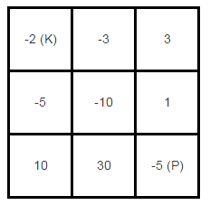

174. Dungeon Game[H]
---
# 问题
he demons had captured the princess (P) and imprisoned her in the bottom-right corner of a dungeon. The dungeon consists of M x N rooms laid out in a 2D grid. Our valiant knight (K) was initially positioned in the top-left room and must fight his way through the dungeon to rescue the princess.

The knight has an initial health point represented by a positive integer. If at any point his health point drops to 0 or below, he dies immediately.

Some of the rooms are guarded by demons, so the knight loses health (negative integers) upon entering these rooms; other rooms are either empty (0's) or contain magic orbs that increase the knight's health (positive integers).

In order to reach the princess as quickly as possible, the knight decides to move only rightward or downward in each step.

Write a function to determine the knight's minimum initial health so that he is able to rescue the princess.

For example, given the dungeon below, the initial health of the knight must be at least 7 if he follows the optimal path `RIGHT-> RIGHT -> DOWN -> DOWN`.

Notes:

- The knight's health has no upper bound.

- Any room can contain threats or power-ups, even the first room the knight enters and the bottom-right room where the princess is imprisoned.

# 思路

这道题和《064.Minimum Path Sum》很相似，这里粗看是求线路上负值最小，但是仔细一想，这里有个问题，如果血量低于0，就是会立刻死去，所以这里其实是要找到一条线路，线路上任意时刻的累计负值最小。所以这里需要存到每个点的时候的线路上出现过的负值最大值。而为了方便计算后续的负值，还需要加上一个到当前的时候的值

设：R(i,j)表示走到i,j余留的值
D(i,j)表示走到i,j 最大伤害量（最大负值）
G(i,j)：表示i.j格子内值

每到一个新的点，我们要判断是从上走下来需要的血多，还是从左边走过来需要的血多：
remain_up = R(i-1,j) + G(i,j)
remain_left = R(i,j-1) + G(i,j)
damage_up = Min(up, D(i-1,j))   //这里用最小值是看是不是超过了原线路上的最小值
damage_left = Min(left,D(i,j-1))

我们看到底是从左边还是上边走下来需要的血量更多
if(damage_up < damage_left)  //说明从左边过来需要血量小
{
    R(i,j) = remain_left;
    D(i,j) = damage_left;
}
else{
    R(i,j) = remain_up;
    D(i,j) = damage_up;   
}

如果最后伤害大于0，那么返回1，否则返回伤害的绝对值+1

