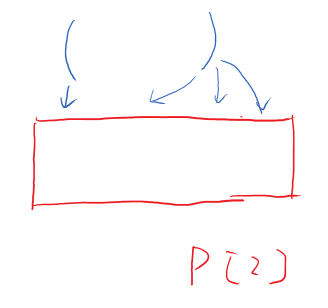
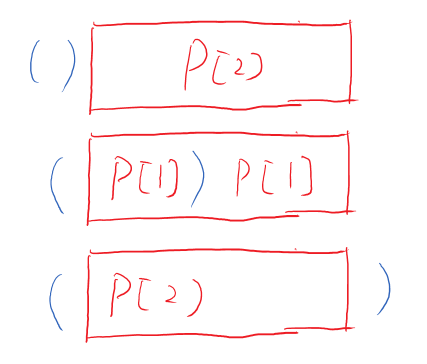

22. Generate Parentheses[M]
--
#问题

Given n pairs of parentheses, write a function to generate all combinations of well-formed parentheses.

>For example, given n = 3, a solution set is:

>"((()))", "(()())", "(())()", "()(())", "()()()"

#思路1——DP
设：P[i]表示当n=i的时候括号组合串。
观察规律：我们知道，要形成一个括号的组合，肯定不是凭空产生的，产生一个P[3]的组合，那肯定是把"("和")"分别插在P[2]中间的。




我们假设产生P[3]组合的时候，之前的组合都是正确的，那么通过插入"("，")"肯定会把P[2]分成两个部分（括号内一个，括号外一个）

看似好像有很多插入的方法，但是，其实仔细想想，反正"("得增加一个，由于括号组合的第一一定是"("，为什么不把新增的"("放在开头呢？这样我们就只用考虑")"了

会怎么把P[2]切割就好了，我们知道P[2]的组合有P[0]+P[2]，P[1]+P[1]，P[2]+P[0]，




通过写出前几个可以观察到下面的规律
P[0]= [""]
P[1] = [()] = "("+P[0]+")"+P[0]
P[2] = [()(),(())] = "("+P[0]+")"+P[1] ,  "("+P[1]+")" +P[0]
P[3] = [()()(),()(()),(())(),(()()),((()))] = "("+P[0]+")"+P[2] ,  "("+P[1]+")"+P[1],  "("+P[2]+")" +P[0]

我们可以知道了组合方式：
- P[i] = "("+P[i-j-1]+")"+P[j]   ($j \in [0,n-1]$)


```java

public class Solution {
    public List<String> generateParenthesis(int n) {
        List<List<String>> result = new ArrayList<List<String>>();
        //初始化P[0] = ""
        result.add((List<String>)Arrays.asList(new String []{""}));       
        for(int i=1;i <= n;i++)
        {
            result.add(new ArrayList<>());
            for(int j = 0; j < i;j++)
            {
                //获取P[k]
                for (String s1 : result.get(j)) {
                    //获取P[i-j-1]
                    for(String s2 : result.get(i-j-1))
                    {
                         result.get(i).add("(" + s1 + ")" + s2);
                    }
                }
            }
        }
        return result.get(n);
    }
}
```


#思路2：回溯
假设我能枚举所有的情况，我们考虑合理的括号组合是什么样的：
1. 左括号数==右括号数
2. 左括号一定要先于右括号

所以我们可以用一个大数组来表示字符串，2个指针left，right来表示左右括号，我们递归遍历所有情况，把满足条件的情况加入list就行了。


```
public class Solution {
    public List<String> generateParenthesis(int n) {
        LinkedList<String> result = new LinkedList<String>();
        if(n== 0)   return result;
        backtracing(result,0,0,"",n);
        return result;
    }
    void backtracing(LinkedList<String> result, int left, int right, String par, int max)
    {
        if(par.length() == 2*max)
        {
            result.add(par);
            return;
        }
        if(left < max)
            backtracing(result,left+1,right,par+'(',max);
        if(right < left)
            backtracing(result,left,right+1,par+')',max);    
    }

}
```

