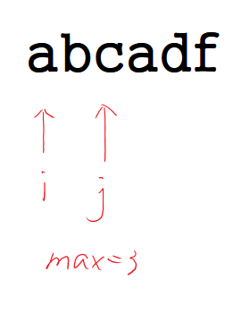
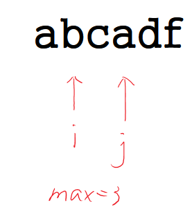
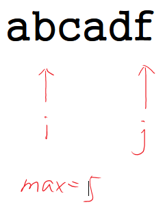

003. Longest Substring Without Repeating Characters[M]
---
#题目：
Given a string, find the length of the longest substring without repeating characters. For example, the longest substring without repeating letters for "abcabcbb" is "abc", which the length is 3. For "bbbbb" the longest substring is "b", with the length of 1.

#分析
题目意思是在一个字符串中找一个最长的子串（没有重复的字母）
在简单的思路：
从左往右扩展子串，维持2个变量i和j来维持一个新的子串，j不断移动，每加入一个新的字符，判断是否有重复的，如果有重复的，移动i，生成新子串……
```
  len = max(len,j-i+1);
```





这里有个问题就是，如何判断子串中是否有重复的字符，传统思路就是循环，这样每次查找重复的时间复杂度为O(n)，导致整体时间复杂度为O(N^2)，其实我们可以使用hashmap来存，这样可以保证每次查找的效率为O(1)。

#代码
```c++
class Solution {
public:
    int lengthOfLongestSubstring(string s) {
        unordered_map<char,int> mymap;
        unordered_map<char,int>::iterator it;
        int len = 0,i = -1;
        for(int j=0;j < s.length();j++)
        {
		    /***是否有重复******/
            it = mymap.find(s.at(j));
            if(it != mymap.end())
            /*****有重复的时候，移动i*****/
                i = std::max(it->second,i);
            /****把新的字符加入*******/
            mymap[s.at(j)] = j;
            len = std::max(len,(j-i));
        }
        return len;
    }
};
```

但是实际上，对于这个题目，不需要用hashmap，因为所有的字符ASCII码加起来也就最多255个，可以直接用数组来代替hashmap，效率更高。

```c++
class Solution {
public:
    int lengthOfLongestSubstring(string s) {
        vector<int> mymap(255,-1);
        int len = 0,i = -1,tmp;
        for(int j=0;j < s.length();j++)
        {
            tmp = mymap[s.at(j)];
            i = std::max(tmp,i);
            mymap[s.at(j)] = j;
            len = std::max(len,(j-i));
        }
        return len;
    }
};
```
上面用了一个trick就是每个数组的初始化为-1表示没有出现重复，它不可能比i的初始值大，如果有重复的，直接覆盖，这样可以不用额外的语句判断是否出现重复。

