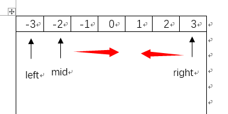

015. 3Sum
---
#问题
Given an array S of n integers, are there elements a, b, c in S such that a + b + c = 0? Find all unique triplets in the array which gives the sum of zero.

Note:
Elements in a triplet (a,b,c) must be in non-descending order. (ie, a ≤ b ≤ c)
The solution set must not contain duplicate triplets.
    For example, given array S = {-1 0 1 2 -1 -4},

    A solution set is:
    (-1, 0, 1)
    (-1, -1, 2)

#思路
 
>这个问题其实就是2 SUM的变种问题，和这个问题类似的还有4SUM，解题思路也可以参考2SUM。我们知道2SUM还可以用暴力两重循环解决，3SUM如果暴力就要三重循环，想想也可怕。

考虑一下如何将3SUM问题转变一下：如果我们随机确定了一个数a，问题是不是就变成了，在剩下的数里面找到2个数和为0-a，是不是就和2SUM问题一样了？

其实这题相比2SUM多了几个难点：

<font color = blue>1. 数组里允许重复的数
<font color = blue>2. <font color = blue>结果要按升序排列
<font color = blue>3. <font color = blue>结果中不能出现重复的结果


当然，我们可以通过写很多条判断语句解决这些问题，但是其实稍微想一下，可以发现，只要保证数组一开始就有序就好办很多了。

我们可以选择3个变量，left，mid，right。在循环的时候，永远保证相对顺序就行了。这样在插入结果的时候，就自然是升序的。

我们可以参考[2SUM的思路2]()解决这道题。

首先，我们考虑如何确定第一个数left，这肯定是我们第一层循环。第一个数可不能无限制的随便选，因为我们要保证上面的几个条件都满足，我们要保证它时刻是最小的数，那么我们可以考虑left取到全部非正数就行了。（如果要和为0，至少要有1个非正数）

		for (int left = 0; left < nums.length && nums[left] <= 0; left++)

然后就是mid和right的确定了，我们采用思路2的方案，mid和right分别从两端往中央扫描，如果mid+right还比较小，那就需要mid右移，反之right左移
<center>

我们可以写出如下的代码:
```java
 mid = left+1; right = nums.length-1;
 while(mid < right)
 {
	  int tmp = 0-nums[left];
	  if(nums[mid] + nums[right] == tmp)
              addtolist;
      else if(nums[mid] + nums[right] < tmp)
              mid++;
      else
              right--;
 }
```

一切看起来特别美好了，可以当你提交的时候，你会发现，还是会报错，因为它虽然能解决问题2，但是不能处理重复结果。举个最简单的例子：
-2 -2 -1 -1 0 1 1 2 2 
这个代码会输出数个[-2 0 2] [-1 0 1] ，解决方案也很简单，如果一个left指向的数是之前判断过的，跳过，如果mid和right往中间移动的时候，是刚才的数，也跳过。
```java
 mid = left+1; right = nums.length-1;
 while(mid < right)
 {
	  int tmp = 0-nums[left];
	 //跳过left重复匹配
	  if(left > 0 && nums[left] == nums[left-1])
              continue;
              
	  if(nums[mid] + nums[right] == tmp)
      {
            int tmp_mid = nums[mid],tmp_right= nums[right];
            list.add(Arrays.asList(nums[left], nums[mid], nums[right]));
            //跳过right和mid的重复匹配
            while(mid < right && nums[++mid] == tmp_mid);
            while(mid < right && nums[--right] == tmp_right);
      }
      else if(nums[mid] + nums[right] < tmp)
              mid++;
      else
              right--;
 }
```

#代码


```java
public class Solution {
    public List<List<Integer>> threeSum(int[] nums) {       
        Arrays.sort(nums);
        List<List<Integer>> list;
        list = new ArrayList<List<Integer>>();
        int mid,right;
        //left只用循环所有的非正数就行了（不是负数是因为还要考虑[0 0 0]的情况所以是非正数）
        for (int left = 0; left < nums.length && nums[left] <= 0; left++) {
            mid = left+1; right = nums.length-1;
            int tmp = 0-nums[left];
            //跳过left重复匹配
            if(left > 0 && nums[left] == nums[left-1])
                continue;
            while(mid < right)
            {
                if(nums[mid] + nums[right] == tmp)
                {
                    int tmp_mid = nums[mid],tmp_right= nums[right];
                    list.add(Arrays.asList(nums[left], nums[mid], nums[right]));
                    //跳过right和mid的重复匹配
                    while(mid < right && nums[++mid] == tmp_mid);
                    while(mid < right && nums[--right] == tmp_right);
                }
                else if(nums[mid] + nums[right] < tmp)
                    mid++;
                else
                    right--;
            }
        }
        return list;
    }
}
```

