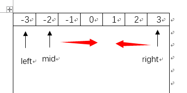

16. 3Sum Closest [M]
---

Given an array S of n integers, find three integers in S such that the sum is closest to a given number, target. Return the sum of the three integers. You may assume that each input would have exactly one solution.

 >   For example, given array S = {-1 2 1 -4}, and target = 1.
 >    The sum that is closest to the target is 2. (-1 + 2 + 1 = 2).

#思路
 
>这个问题等于是3SUM又升级了，因为这里现在是最接近的结果，所以Hashmap的思路基本没用了，因为必须得要循环找到所有可能。当然，这个题目有个限制就是只有唯一的结果，所以，如果发现完全相等的，也就可以停下来了。

但是解题思路还是可以参考3SUM，算法基本一样，有些地方需要修改一下。首先，因为是找最接近的，所以要考虑所有情况，left循环到length-2

		for (int left = 0; left < nums.length-2; left++)

然后还是mid和right分别从两端往中央扫描，如果mid+right还比较小，那就需要mid右移，反之right左移<font color=red>（每次如果有最小的就存下来）</font>
<center>

我们可以写出如下的代码:
```java
 mid = left+1; right = nums.length-1;
 while(mid < right)
 {
	  int tmp = target-nums[left];
	  if(abs(tmp - nums[mid] + nums[right]) < abs(target-Min))
		  Min = nums[left] + nums[mid] + nums[right]);
	  if(nums[mid] + nums[right] == tmp)
              return Min;
      else if(nums[mid] + nums[right] < tmp)
              mid++;
      else
             right--;
 }
```


#代码


```java
public class Solution {
    public int threeSumClosest(int[] nums, int target) {       
        Arrays.sort(nums);
        int mid,right;
        if(nums.length < 3)
            return 0;
        int Min = nums[0]+nums[1]+nums[2];
        //left要循环全部
        for (int left = 0; left < nums.length-2; left++) {
            mid = left+1; right = nums.length-1;
            int tmp = target-nums[left];
            while(mid < right)
            {
                if(Math.abs(tmp - nums[mid] - nums[right]) <Math.abs(target - Min))  //每次查看是不是最小的情况
                    Min = nums[left]+ nums[mid] + nums[right];
                if(nums[mid] + nums[right] == tmp)
                {
                    return target;   //因为只有一种答案所以可以直接返回
                }
                else if(nums[mid] + nums[right] < tmp)
                    mid++;
                else
                    right--;
            }
        }
        return Min;
    }
}
```

