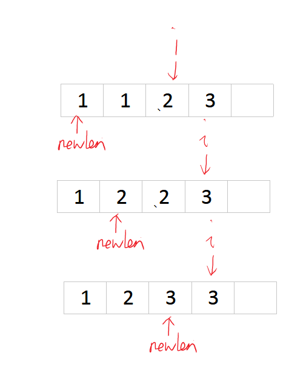

26. Remove Duplicates from Sorted Array[E]
---
 
#问题
Given a sorted array, remove the duplicates in place such that each element appear only once and return the new length.

Do not allocate extra space for another array, you must do this in place with constant memory.

For example,
Given input array nums = [1,1,2],

Your function should return length = 2, with the first two elements of nums being 1 and 2 respectively. It doesn't matter what you leave beyond the new length.

#思路
这题因为是排序好的，所以很容易做。这里关键点是"删除多余元素"这句话，这里其实不是真的删除，因为题目要求不能用额外的空间，所以最好的思路是替换。题目也说了“It doesn't matter what you leave beyond the new length.”，所以我们只要把后面的元素放到前面来就行了。

这里用2个指针:
- 1个指针i从1移动到length
- 1个指针newlen记录不重复的个数，只有出现不重复的时候它才能+1


```java
public class Solution {
    public int removeDuplicates(int[] nums) {
        if(nums.length < 2) return nums.length;
        int newlen = 1;
        for(int i = 1;i < nums.length;i++)
        {```
          if(nums[i] != nums[i-1]) nums[newlen++] = nums[i];
        }
        return newlen;
    }
}
```
