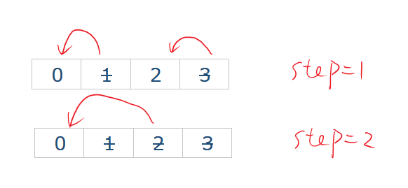
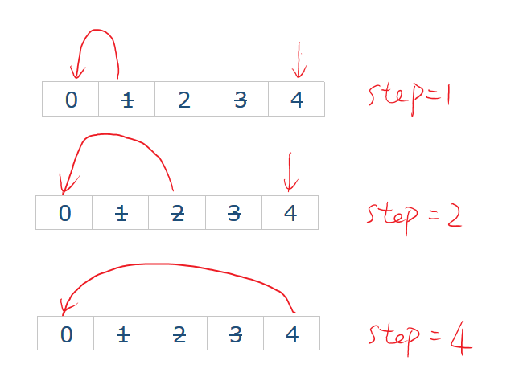

023. Merge k Sorted Lists [H]
---
#问题
Merge k sorted linked lists and return it as one sorted list. Analyze and describe its complexity.

Subscribe to see which companies asked this question
#思路
这题明显就是Merge two sorted list的升级版，我们知道，那题我们可以用2个指针完成，但是这题，难道要用K个指针？

思路1：每次循环K下，找到每个链表的头，然后把最小的插入新链表中，把这个链表头弃掉，然后重复这个操作。这个最多需要循环K*K*n次

思路2：二路归并，每次合并两个链表最多合并$log_2N$次

流程：
- 先每隔2个合并，结果放到合并的第一个链表处
- 再每隔4个合并，结果放到合并的第一个链表处
……
- 每隔K/2个合并，结果放到合并的第一个链表处
- 返回第一个链表
```java
//控制每隔多少
 for(int step = 1;step < lists.length;step*=2)
//遍历所有可以合并的选项
    for(int i = 0;i < lists.length;i+=step*2)
```
假设K= 4：（偶数相对好处理）

- 先合并L[0],L[1]放到L[0]
- 然后合并L[2],L[3]放到L[2]
- 最后合并L[0],L[2]放到L[0]
- 返回L[0]就好了


假设K=5：(麻烦点，当运行到L[4]的时候它没有下个可以和它合并的元素了，所以应该跳出循环)


```java
//控制每隔多少
 for(int step = 1;step < lists.length;step*=2)
//遍历所有可以合并的选项
    for(int i = 0;i < lists.length;i+=step*2)
    {
        //如果某个元素没有下一个元素就退出循环
         if(i+step >= lists.length) break;
         lists[i] = mergeTwoLists(lists[i],lists[i+step]);
    }
```

所以代码涉及2层循环，外面是控制每隔多少合并一次，里面是遍历所有可以合并的链表，进行合并操作。


```java
 public ListNode mergeKLists(ListNode[] lists) {
        if(lists.length == 0)
            return null;
        //控制每隔多少
        for(int step = 1;step < lists.length;step*=2)
            //遍历所有可以合并的选项
            for(int i = 0;i < lists.length;i+=step*2)
            {
                //如果某个元素没有下一个元素就退出循环
                if(i+step >= lists.length) break;
                lists[i] = mergeTwoLists(lists[i],lists[i+step]);
            }
        return lists[0];
    }
    //完全是之前的代码
    public ListNode mergeTwoLists(ListNode l1, ListNode l2) {
        ListNode result = new ListNode(0);
        ListNode tmp = result;
        while(l1 != null || l2 != null)
        {
            if(l2 == null || (l1 != null && l1.val <= l2.val))
            {
                tmp.next = l1;
                l1 = l1.next;
            }
            else 
            {
                tmp.next = l2;
                l2 = l2.next;
            }
            tmp = tmp.next;
        }
        return result.next;
    }

```
